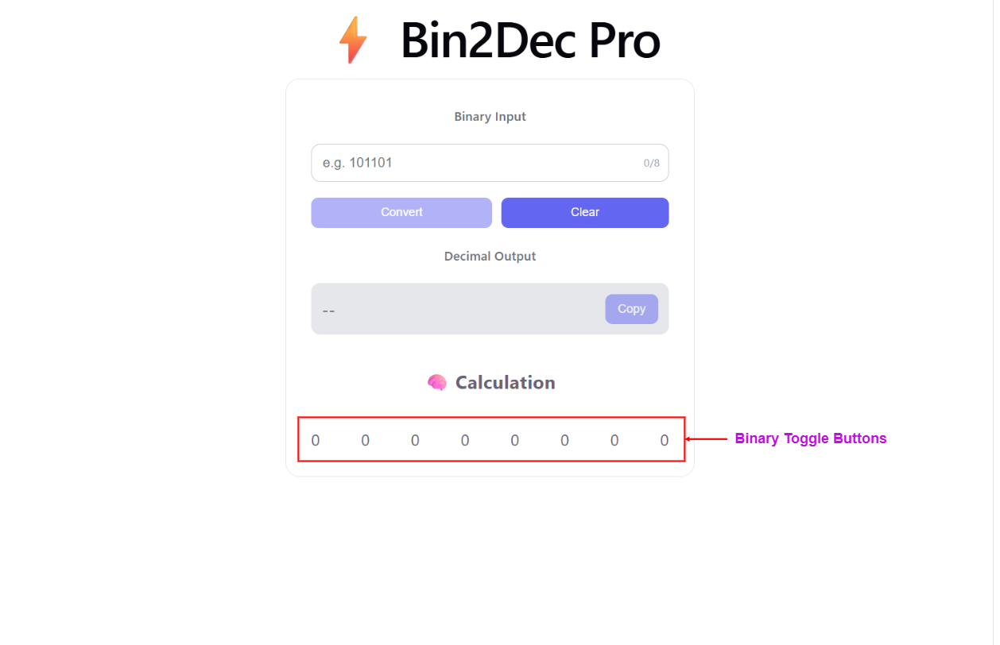
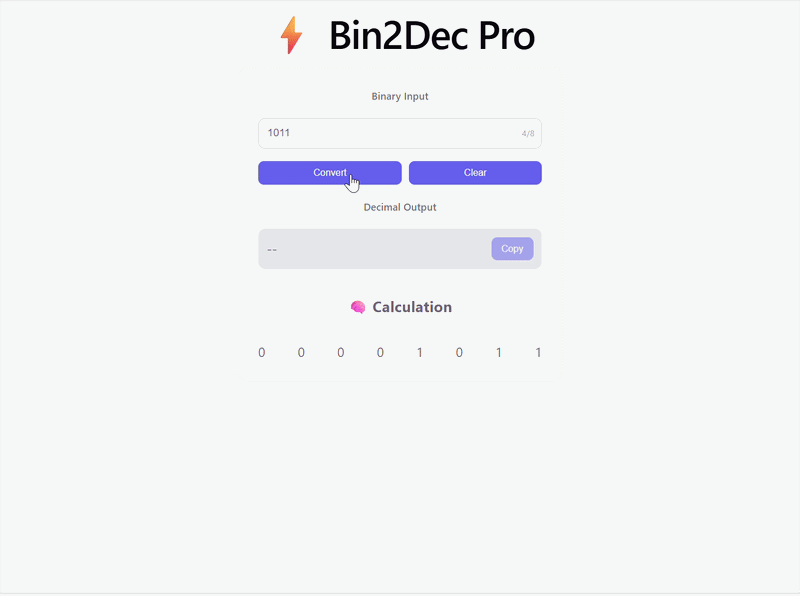

# bin2dec-ts

A binary to decimal converter application built with React, TypeScript, and Vite.

## Overview


*Main application interface showing the binary to decimal conversion tool with interactive bit toggles and step-by-step breakdown*

### What is bin2dec-ts?

**bin2dec-ts** is an interactive educational tool designed to help users understand binary-to-decimal number conversion. The application provides a visual and interactive interface for:

- Converting binary numbers to their decimal equivalents
- Toggling individual bits in real-time with instant conversion updates
- Viewing a detailed step-by-step breakdown of the conversion calculation
- Learning how binary arithmetic works through hands-on interaction

## Features

### 🔄 Binary to Decimal Conversion


Convert any binary number directly to its decimal representation. Enter a binary string and instantly see the decimal result.

### 🎯 Interactive Bit Toggling


Click individual bit positions (0 or 1) to toggle them on and off. Watch the decimal value update in real-time as you manipulate the binary digits.

### 📊 Step-by-Step Breakdown


View a detailed mathematical breakdown showing how each bit position contributes to the final decimal value, helping users understand the binary conversion process.

### 🎨 Modern UI with TypeScript
Built with a modern, responsive user interface using React and TypeScript for type-safe, maintainable code.

## Prerequisites

Before setting up the project, ensure you have the following installed on your system:

- **Node.js** (v16.0.0 or higher) - [Download](https://nodejs.org/)
- **npm** (comes with Node.js) or **yarn**

You can verify your installations by running:
```bash
node --version
npm --version
```

## Installation

1. **Clone or navigate to the project directory**:
```bash
cd bin2dec-ts
```

2. **Install dependencies**:
```bash
npm install
```

This will install all the required packages listed in `package.json`.

## Running the Project

### Development Server

To start the development server with hot module replacement (HMR):

```bash
npm run dev
```

The application will be available at `http://localhost:5173` (or another port if 5173 is in use). Any changes you make to the code will automatically reload in the browser.

### Building for Production

To create an optimized production build:

```bash
npm run build
```

This will:
- Compile TypeScript (`tsc -b`)
- Bundle the project with Vite
- Generate optimized files in the `dist/` directory

### Preview Production Build

To preview the production build locally:

```bash
npm run preview
```

### Code Quality

To run ESLint and check for code issues:

```bash
npm run lint
```

## Component Overview

### Bin2Dec Component


**Functionality:** The main converter component that manages the application state and orchestrates the conversion logic. Displays the current binary input and decimal output.

### BitToggle Component


**Functionality:** Individual bit toggle buttons representing each bit position in the binary number. Users can click these buttons to toggle between 0 and 1, and the conversion updates automatically.

### StepBreakdown Component


**Functionality:** Displays a detailed mathematical breakdown of the conversion process, showing how each bit position (2^n) and its value contribute to the final decimal result.

## Project Structure

```
bin2dec-ts/
├── src/
│   ├── components/        # React components
│   │   ├── Bin2Dec.tsx
│   │   ├── BitToggle.tsx
│   │   └── StepBreakdown.tsx
│   ├── types/             # TypeScript type definitions
│   ├── utils/             # Utility functions (converter.ts)
│   ├── App.tsx            # Main App component
│   ├── main.tsx           # Application entry point
│   ├── index.css          # Global styles
│   └── App.css            # App component styles
├── public/                # Static assets
├── index.html             # HTML entry point
├── package.json           # Project dependencies and scripts
├── vite.config.ts         # Vite configuration
├── tsconfig.json          # TypeScript configuration
└── eslint.config.js       # ESLint configuration
```

## Available Scripts

| Command | Description |
|---------|-------------|
| `npm run dev` | Start development server with HMR |
| `npm run build` | Build for production |
| `npm run lint` | Run ESLint to check code quality |
| `npm run preview` | Preview the production build |

## Technologies Used

- **React** 19.2.4 - UI library
- **TypeScript** 6.0.2 - Type-safe JavaScript
- **Vite** 8.0.4 - Build tool and dev server
- **ESLint** 9.39.4 - Code linting

## Troubleshooting

### Port 5173 is already in use
The dev server will automatically try the next available port. You can also specify a port manually:
```bash
npm run dev -- --port 3000
```

### Dependencies not installing
Try clearing the npm cache:
```bash
npm cache clean --force
npm install
```

### TypeScript compilation errors
Run the TypeScript compiler to check for type errors:
```bash
npx tsc -b
```